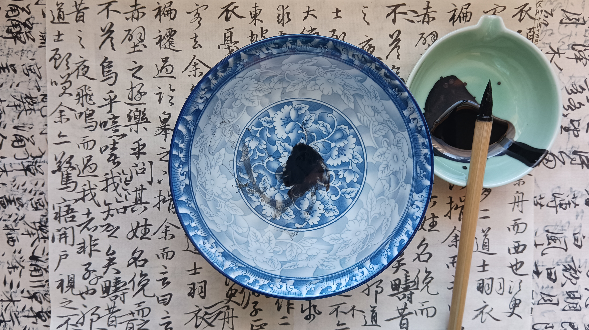

Title:  title
Author: Al Zee  
Email:  z@alz.ee  
Web:    https://alz.ee  
Date:   Sun, 15 Oct 2023 15:34:12 +0800
Link:   https://alz.ee/article/jing
Tags:   

# title

以前还笑话用笔洗的人。如今有水龙头这么方便。简直腐朽。  
结果当然还是自己无知。  
用水龙头，手指或捏或捋或刮，都不济事。冲几分钟，甩出来还是黑，事倍功半，水还不知道要去多少。费时费力费水。  
我后来用一碗做笔洗，笔在碗里打圈，在沿上轻刮，待刮下的水不黑即可，两碗水足矣。  
况且坐着刮笔，一心二用，或看字，或发怔，岂不比站在水龙头前惬意。  
以前非要洗到清澈，耽误不少时间，后来知道，大可不必。爱惜保养是当然的，但不管多好的笔，到底是器，是为人所用的，不能反过来成了人为之服务，那就是玩物了。  
有一碗水在旁，还有一个妙用。  
要往墨里加水时，手指去碗里蘸便是。轻点，垂垂欲滴而不得下；一指节，得一滴；两指节，得二三滴；还要多，则二三指捻水，聚在一指，就有一股细流。随心所欲，轻而易举，比砚滴好用多了。  
所以现在桌上总搁一碗水。其用有三。  
一是笔洗。  
二是代替了砚滴。  
三则当一个摆件，此物叫作——心如止水。

