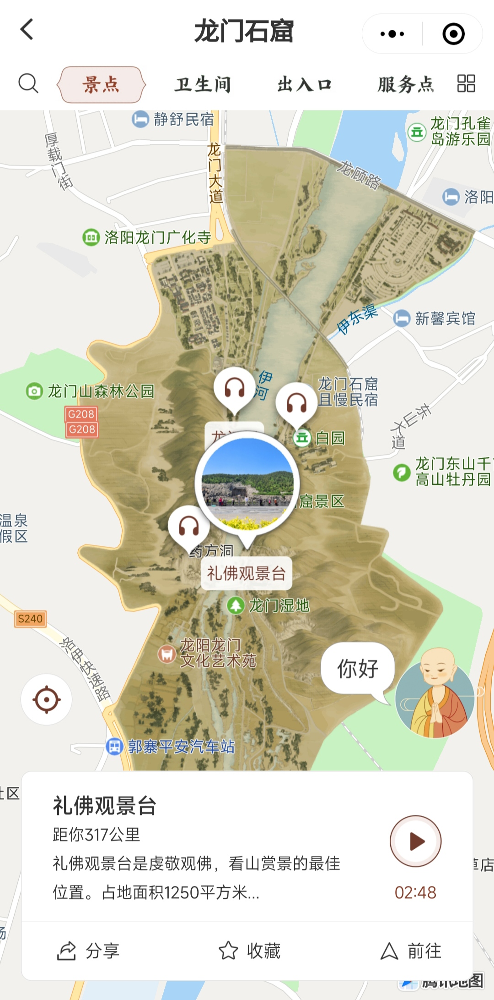

Title:  title  
Author: Al Zee  
Email:  z@alz.ee  
Web:    https://alz.ee  
Date:   Thu, 20 Jun 2024 13:41:19 +0800  
Link:   https://alz.ee/article/miniprog_map.md  
Tags:   

# 小程序手绘地图

客户的小程序用于景区展示。为了美观，客户特意定制了手绘地图，希望贴在标准地图上。类似于这样的效果：




小程序中添加图层目前有3种方案：
1. 腾讯位置服务提供的[`个性化图层`](https://lbs.qq.com/customMap/)
1. 制作H5页面，调用各个地图服务的`自定义栅格图层`或`静态图贴地图层`接口，小程序中通过webview嵌套网页
1. 小程序接口[`MapContext.addGroundOverlay`](https://developers.weixin.qq.com/miniprogram/dev/api/media/map/MapContext.addGroundOverlay.html)

从技术角度讲，方案1是最优的，因为切成了瓦片地图，不同缩放级别显示不同尺寸的图片，效果也应该是最好的。但该功能要在小程序中使用，需要支付5万元/年[^1][^3][^2]。这对于大部分场景来说是不可接受的。   
方案2可以解决问题，但抛开性能不说，webview到H5，再通过[`JS-SDK`](https://developers.weixin.qq.com/doc/offiaccount/OA_Web_Apps/JS-SDK.html)到微信，兜了一圈，也实在算不上优雅。  

所以小程序端的方案就是`MapContext.addGroundOverlay`。

该接口主要参数`bounds`:
```ts
bounds: {
  southwest: {
    longitude: number,
    latitude: number
  },
  northeast: {
    longitude: number,
    latitude: number
  }
}
```
通过东北和西南两角的坐标，即可确定贴图覆盖面积，从而实现跟随地图一同缩放的效果。

但我们还不能简单的将一张完整的图片贴上去，因为就社区反馈，单张图片大于`300K`~`500K`时，图片在安卓手机上不显示。经我尝试，`500K+`是能显示的，但客户的图片上十兆，也的确是显示不了。至于具体的阈值，是个谜！而且图片过大时，分成多张图片一起加载，性能也更优。

所以我们需要切图，比如`4*4=16`，`8*8=64`。

这里以Deborah Shelton的一张旧杂志封面为例。

### 先用AI去掉背景。


### 切图
用`ImageMagick`切图[^crop]。   
图片宽高比接近6:8，所以这里切成每行6块，每列8块。得到编号从`0`至`47`，共48块等分的瓦片:
```bash
# 边缘尺寸不够的自动用空白填充
convert deb.png -crop 6x8@  +repage  +adjoin  %d.png
```


### 添加图层
通过循环嵌套逐个添加图层。代码片段如下，其中`col`和`row`须和切图时的比例一致。
```ts
const mapContext = Taro.createMapContext('map')

const center = { lat: 32.631533, long: 110.788021 }
const ne = { lat: 32.642654, long: 110.796282 }
const sw = { lat: 32.621354, long: 110.778333 }
const opacity = 1
const col = 6
const row = 8
const latPer = (ne.lat - sw.lat) / row
const longPer = (ne.long - sw.long) / col

for (let i = 0; i < row; i++) {
  const neLat = ne.lat - latPer * i
  const swLat = ne.lat - latPer * (i + 1)
  let neLong
  let swLong
  for (let j = 0; j < col; j++) {
    neLong = sw.long + longPer * (j + 1)
    swLong = sw.long + longPer * j
    const northeast = {
      latitude: neLat,
      longitude: neLong
    }
    const southwest = {
      latitude: swLat,
      longitude: swLong
    }
    const bounds = {
      northeast,
      southwest,
    }

    const index = col * i + j

    const src = Env.imageUrl + 'deb/' + index + '.png'
    const o = {
      id: index,
      src,
      opacity,
      // zIndex: 1,
      bounds,
    }

    mapContext.addGroundOverlay(o)
    .then(res => {
      console.log('groundOverlay added')
    })
    .catch(err => {
      console.log(err)
    })
  }
}
```

### 最终效果


[^1]: 现在是否支持地图瓦片（图层）工具配置至小程序地图上？: https://lbs.qq.com/FAQ/custom_faq.html
[^3]: 微信小程序上能否使用: https://lbs.qq.com/dev/console/customLayer/guide
[^2]: 如何申请商业授权？费用是多少呢？: https://lbs.qq.com/FAQ/authorization_faq.html
[^js-sdk]: js-sdk: https://developers.weixin.qq.com/doc/offiaccount/OA_Web_Apps/JS-SDK.html
[^crop]: Cropping into roughly Equally Sized Divisions: https://imagemagick.org/Usage/crop/#crop_equal
