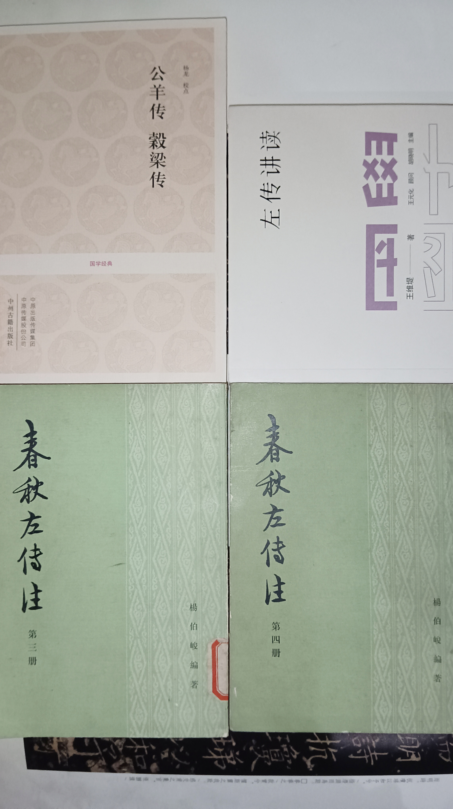
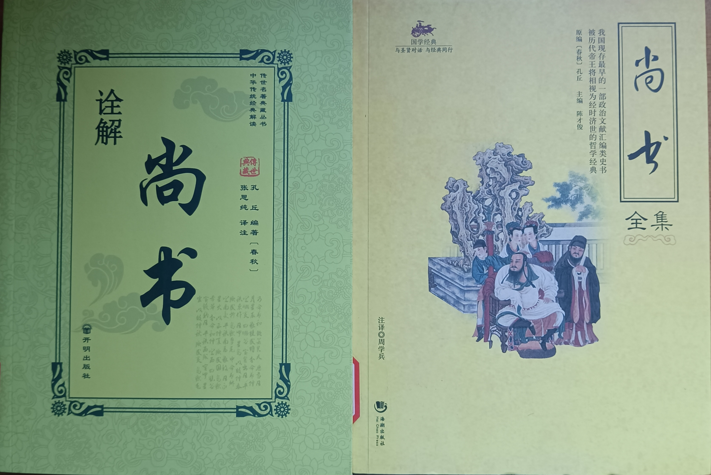
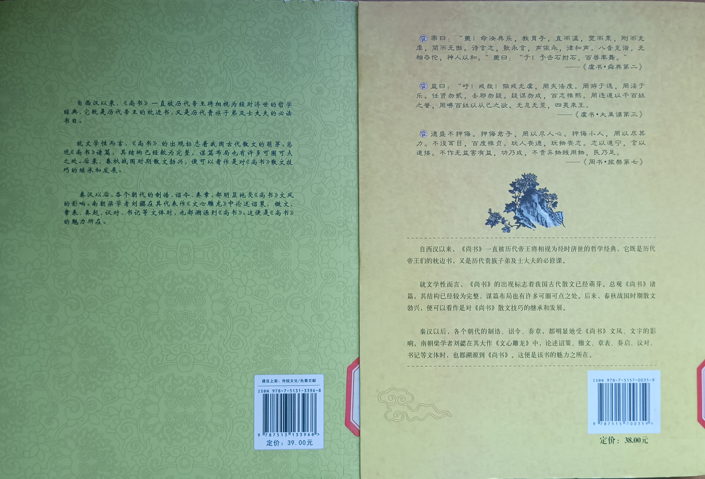
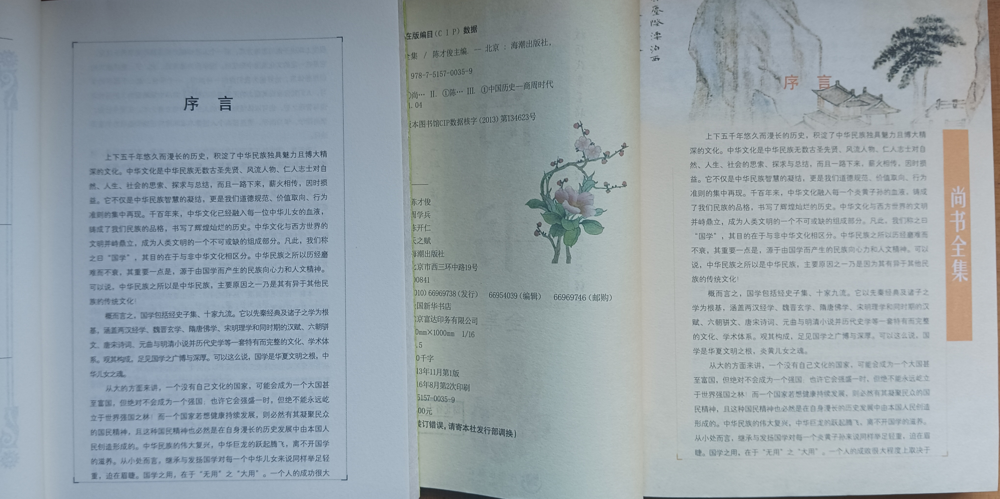
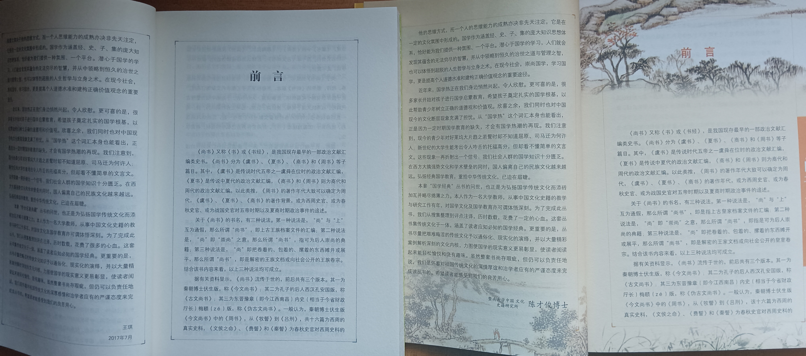
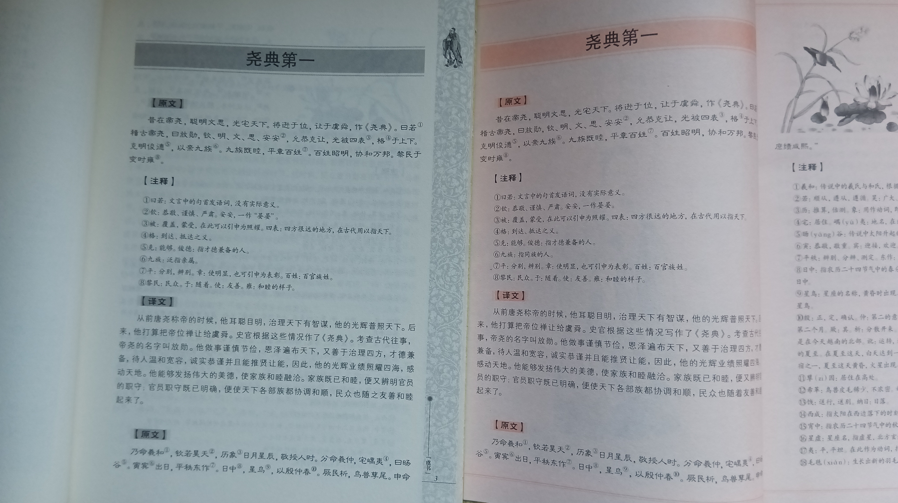
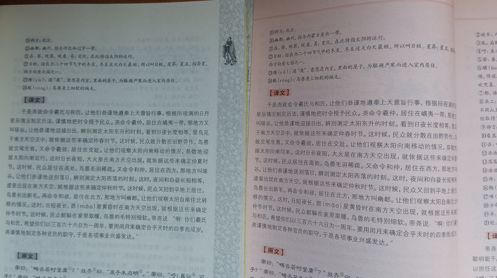

早十公里。  
近来左膝伤作祟，今日尤甚，全程有痛感。腿部训练有待加强。

读完《礼记》。  
爱读的有《曲礼》、《学记》、《乐记》、《坊记》、《表记》、《缁衣》、《儒行》、《冠义》等，《大学》《中庸》就不消说了。

在我看来，最特别的当属《学记》。特别在于，其它篇目大都是特征明显的儒家学说，而《学记》可以无关乎流派，就是单纯的讲“学”。更可贵的是其不仅说“学”，还变换角度，说了“教”，还说的如此精妙。  
> “今之教者，呻其占毕，多其讯言，及于数进而不顾其安，使人不由其诚，教人不尽其材。其施之也悖，其求之也佛。夫然，故隐其学而疾其师，苦其难而不知其益也。虽终其业，其去之必速，教之不刑，其此之由乎！”

读罢汗颜。  
并指出要“*既知教之所由兴，又知教之所由废*”。  
再有“*知其心，然后能救其失也*”，“*教也者，长善而救其失者也*”等等。  
这些教育思想，放在今天，也是先进。  
而所谓“*大德不官，大道不器，大信不约，大时不齐*”，以愚见，“*察于此四者*”，既是始，也是终。  
叹为观止！

至于《檀弓》、《祭法》、《祭义》、《祭统》、《问丧》、《服问》、《间传》、《丧服四制》……之类，或丧或祭，以如今的眼光看，实在陈腐。虽不像《尚书》那样晦涩聱牙，枯燥却有的一比，味同嚼蜡，难以下咽，翻过去就忘了。正是“*其去之必速*”。

四书五经还剩下《易》和《春秋》。  
子曰：“*加我数年，五十以学易，可以无大过矣*。”  
周易太深，我还是再等等。

去图书馆借了春秋三传。可惜《左传》第一册连工作人员都找不到，只拿到后三册，还是八一年的本，枯黄。  
也是意料之中。以我的经验，经史子集，里面基本找不到好而全的版本。好歹也是市级图书馆，很让人苦恼。  
能找到的，大多是不入流的出版社。  
我借过两本讲尚书的，前言、序言、注释、译文，一字不差，甚至字体、排版都一样，可是书名不同，作者各异。可笑！  
两本书，书名一本叫《尚书全集》，一本叫《诠解尚书》；出版社一个叫“海潮出版社”，一个叫“开明出版社”。点名批评！  
中国纺织出版社有一个叫做“全鉴”的系列，算是好的了，但实际“选”而不“全”，错别字还频出，也不靠谱。

下雨天真省墨。平常写一半，干一半。雨天，干的那一半都省下了。   
淅沥萧飒，古琴和之，反倒有些得意。

《碟中谍7》网上可以看了。明年终章，希望在影院看 。

